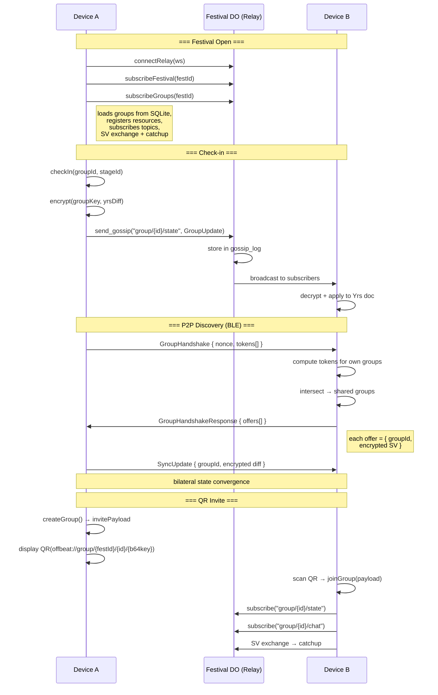

# PRD: Group Pubsub Wiring, P2P Discovery & QR Invite

> Standalone PRD for connecting the existing group infrastructure into a working end-to-end pipeline.

---

## Introduction / Overview

OFFBEAT's group system has all the individual components built — Yrs CRDT documents for group state, AES-256-GCM encryption, topic derivation, chat persistence, protobuf wire encoding, and a Flutter UI — but nothing connects them. A user can call `createGroup` and get back encrypted bytes that go nowhere.

This PRD specifies the work required to:

1. **Subscribe** to group gossip topics when opening a festival
2. **Broadcast** group mutations (check-ins, chat, state changes) via the WS relay
3. **Discover** shared groups between iroh peers via a zero-knowledge handshake
4. **Invite** friends via QR code scanning and deep links

The Cloudflare Festival DO already functions as a blind store-and-forward relay for any topic — no server changes are required.

---

## Goals / Objectives

| Goal | Description |
|------|-------------|
| **End-to-end group sync** | A check-in on device A appears on device B within the existing relay infrastructure |
| **Offline group discovery** | Two peers on BLE/WiFi discover shared groups and sync state without any server |
| **Single-scan invite** | One QR scan gives a new member everything they need to join and sync |
| **Zero plaintext exposure** | The relay never sees group membership, plaintext state, or key material |

---

## Target Audience / User Personas

| Persona | Description |
|---------|-------------|
| **Festival-goer** | 18-35, at a multi-day electronic music festival. Uses the app to coordinate with 2-5 friends. Often in areas with degraded cell signal. |
| **Group creator** | The person who creates the group and shares the invite QR. Expects the process to be fast (< 10s from tap to scannable QR). |
| **Late joiner** | Arrives on day 3, scans a QR from a friend. Expects to see the group's current state (who's where, recent chat) within seconds. |
| **Offline peer** | Two friends at the same stage with no cell signal. Expects BLE to sync group state automatically when in proximity. |

---

## User Stories / Use Cases

### Subscription & Sync

- **S1:** When I open a festival I'm attending, my groups for that festival automatically connect and sync — I see current member locations and recent chat without any manual action.
- **S2:** When I create a group mid-session, it immediately starts syncing via the relay — I don't need to close and reopen the festival.
- **S3:** When I join a group mid-session, I immediately receive the group's current state (members, locations, pins) and recent chat history.
- **S4:** When I reconnect after being offline, the relay replays all group messages I missed during the festival window.

### Mutation Broadcast

- **M1:** When I check in to a stage, all group members see my location update within 1 second (relay path).
- **M2:** When I send a group chat message, all group members receive it — including those who connect later during the festival window (store-and-forward).
- **M3:** When I create a group, the initial state (my membership, group name) is broadcast so peers can sync.

### P2P Group Discovery

- **P1:** When my phone establishes an iroh connection to another peer (any transport), a handshake automatically discovers groups we share.
- **P2:** After discovering shared groups, our devices sync group state (Yrs SV exchange) and recent chat bilaterally.
- **P3:** The handshake reveals nothing about groups we don't share — a non-member learns zero information.
- **P4:** The handshake uses session-scoped tokens — replaying a captured handshake reveals nothing.

### QR Invite

- **Q1:** When I tap "Invite" in a group, I see a QR code that encodes everything a joiner needs (festival ID, group ID, and 32-byte key).
- **Q2:** When I tap "Scan" in the social tab, an in-app camera scanner opens and reads the QR.
- **Q3:** When someone sends me an `offbeat://group/...` link (via iMessage, WhatsApp, etc.), tapping it opens the app and joins the group.
- **Q4:** After scanning/tapping, I join the group and see its current state within 3 seconds.

---

## System Architecture



---

## Data Schema

### Existing (no changes)

| Table | Columns | Notes |
|-------|---------|-------|
| `groups` | `group_id TEXT PK, festival_id TEXT, name TEXT, group_key BLOB(32), created_at TEXT` | Client-side SQLite |
| `chat_messages` | `id TEXT PK, topic TEXT, user_id TEXT, display_name TEXT, text TEXT, timestamp TEXT, writer_seq INTEGER` | Client-side SQLite |
| `docs` | `doc_id TEXT PK, doc_type TEXT, yrs_state BLOB, updated_at TEXT` | Client-side SQLite |
| `gossip_log` | `seq INTEGER PK, topic TEXT, message BLOB, timestamp TEXT` | Festival DO SQLite |

### New: Protobuf Messages

```protobuf
// P2P group discovery handshake
message GroupHandshake {
  bytes session_nonce = 1;          // 16 random bytes
  repeated bytes tokens = 2;        // blake3(key || "hs" || nonce) per group
}

message GroupHandshakeResponse {
  repeated GroupSyncOffer offers = 1;
}

message GroupSyncOffer {
  string group_id = 1;
  bytes encrypted_sv = 2;           // encrypt(group_key, yrs_state_vector)
  string group_key_id = 3;          // blake3(group_key) first 16 bytes hex
}
```

### QR Invite Payload

```
offbeat://group/{festival_id}/{group_id}/{base64url(group_key_32_bytes)}
```

Example: `offbeat://group/wavelength26/a1b2c3d4e5f6g7h8/SGVsbG8gV29ybGQhIFRoaXMgaXMgYSB0ZXN0IGtleQ` (~110 chars, well within QR capacity)

---

## Interface Definitions

### Bridge API (Rust → Flutter via FRB)

| Method | Signature | New? |
|--------|-----------|------|
| `subscribe_groups` | `async fn subscribe_groups(&mut self, festival_id: String) -> Result<()>` | **New** |
| `create_group` | existing — modified to broadcast initial state | Modified |
| `join_group` | existing — modified to subscribe immediately | Modified |
| `check_in` | existing — modified to broadcast diff | Modified |
| `send_group_chat` | existing — modified to broadcast encrypted chat | Modified |

### No new server endpoints. The Festival DO's existing WebSocket protocol handles all group traffic.

---

## Functional Requirements

### FR-1: Group Resource Registration

When `subscribe_groups(festival_id)` is called:

1. Load all groups for the festival from SQLite via `db.load_groups(festival_id)`
2. For each group, register `Resource::GroupState(key)` and `Resource::GroupChat(key)` in the `ResourceRegistry`
3. Trigger `sync_orchestrator.sync_with_peer(ws)` which subscribes to topics and performs SV exchange + chat catchup

**Acceptance criteria:**
- `cargo test` passes test: given a DB with 2 saved groups, calling `register_groups` results in 4 resources (2 state + 2 chat) in the registry, sorted by priority (state HIGH, chat MEDIUM)

### FR-2: Immediate Subscription on Create

When `create_group` succeeds:

1. The new group is persisted to SQLite (already happens)
2. `Resource::GroupState` and `Resource::GroupChat` are registered
3. Topics are subscribed on the WS relay
4. Initial Yrs state is broadcast as `GroupUpdate` on the state topic

**Acceptance criteria:**
- `cargo test` passes test: after `create_group`, the group's state topic is subscribed and the initial state envelope is broadcast

### FR-3: Immediate Subscription on Join

When `join_group` succeeds:

1. Group key is stored in SQLite (already happens)
2. Resources are registered + subscribed
3. SV exchange is triggered for the group state doc
4. Chat catchup is requested for the group chat topic

**Acceptance criteria:**
- `cargo test` passes test: after `join_group`, SV exchange is triggered and chat catchup is requested

### FR-4: Check-in Broadcast

When `check_in(group_id, stage_id)` is called:

1. Update the local Yrs doc (already happens)
2. Encrypt the Yrs diff with the group key (already happens)
3. Wrap in `GossipEnvelope::GroupUpdate`
4. Send via `ws_relay.send_gossip(topic, envelope)`

**Acceptance criteria:**
- `cargo test` passes test: `check_in` produces a correctly formed `GroupUpdate` envelope with the encrypted diff

### FR-5: Chat Broadcast

When `send_group_chat(group_id, text)` is called:

1. Create + encrypt chat message (already happens)
2. Persist locally (already happens)
3. Wrap in `GossipEnvelope::EncryptedChat`
4. Send via `ws_relay.send_gossip(chat_topic, envelope)`

**Acceptance criteria:**
- `cargo test` passes test: `send_group_chat` produces a correctly formed `EncryptedChat` envelope

### FR-6: Store-and-Forward Retention

The Festival DO retains group messages in `gossip_log` for the festival window (start_date to end_date + 24 hours). Messages outside this window are eligible for cleanup.

**Acceptance criteria:**
- Server test: messages stored during the festival window are returned by catchup. (Note: retention cleanup can be a follow-up — the DO currently retains indefinitely.)

### FR-7: P2P Group Handshake

When an iroh peer connection is established:

1. Build handshake: for each local group key, compute `token = blake3(key || "hs" || session_nonce)`
2. Send `GroupHandshake { session_nonce, tokens }` to the peer
3. Peer computes same tokens for its groups, finds intersection
4. Peer responds with `GroupHandshakeResponse { offers }` — one `GroupSyncOffer` per shared group containing `{ group_id, encrypted_sv, group_key_id }`
5. Initiator decrypts each SV, computes Yrs diff, sends encrypted diff back
6. Both sides apply diffs + exchange recent chat

**Acceptance criteria:**
- `cargo test` passes tests:
  - `build_handshake` + `find_shared_groups` roundtrip with 2 shared groups out of 5 total
  - No shared groups → empty result
  - Same nonce + same keys → same tokens (deterministic)
  - Different nonce → different tokens (session-scoped)
  - Full bilateral sync: after handshake, both peers have identical Yrs doc state

### FR-8: QR Code Display

When the user taps "Invite" in a group:

1. Generate the invite URI: `offbeat://group/{festival_id}/{group_id}/{base64url(group_key)}`
2. Render as a QR code in the `InviteSheet`

**Acceptance criteria:**
- `cargo test` passes test: `create_group` returns an `invite_payload` that is a valid `offbeat://group/{festival_id}/{group_id}/{base64url(key)}` URI containing the festival ID and base64url-encoded 32-byte key
- `flutter analyze` passes

### FR-9: QR Code Scanning

When the user taps "Scan":

1. Open in-app camera scanner (via `mobile_scanner` Flutter package)
2. On detecting a QR containing `offbeat://group/...`, call `join_group(invite_payload)`
3. Close scanner, navigate to the group

**Acceptance criteria:**
- `flutter analyze` passes
- Scanner widget correctly parses `offbeat://` URIs and rejects non-offbeat QR codes

### FR-10: Deep Link Handling

Register `offbeat://` as a custom URL scheme:

1. Android: intent filter in `AndroidManifest.xml`
2. iOS: URL type in `Info.plist`
3. App receives the URI on launch/resume, calls `join_group(invite_payload)`

**Acceptance criteria:**
- `flutter analyze` passes
- Deep link handler parses the URI and delegates to `join_group`

---

## Non-Functional Requirements

### NFR-1: Privacy (Zero Plaintext Exposure)

The Festival DO MUST NOT have access to:
- Plaintext group state (member names, locations, pins)
- Group membership lists
- Group key material (32-byte AES keys)
- Group identity (which group a message belongs to, beyond an opaque topic string)

All group payloads on the wire are AES-256-GCM encrypted. The DO stores and relays opaque bytes.

### NFR-2: Offline-First

All group features (view state, check in, send chat) work fully offline from local SQLite + Yrs docs. Sync happens opportunistically when a relay or peer connection is available.

### NFR-3: Handshake Security

- Handshake tokens are session-scoped (16-byte random nonce per handshake)
- Replaying a captured handshake to a different peer reveals nothing
- Token computation uses blake3 keyed by the group key — brute-force requires knowing the 256-bit key
- No group key material leaves the device during the handshake

### NFR-4: Bandwidth Efficiency

- Group state sync uses Yrs SV diffs (only missing updates transmitted)
- Chat sync uses writer-sequence-based catchup (only unseen messages)
- P2P handshake overhead: 16 bytes nonce + 32 bytes per group membership (~176 bytes for 5 groups)

---

## Design Considerations

- The **InviteSheet** already exists in `apps/mobile/lib/screens/social/invite_sheet.dart` with a placeholder QR painter. Replace with real QR generation using the `qr_flutter` or `mobile_scanner` package's QR generation.
- The **Scan sheet** is referenced in the design (`groups-screens.jsx` ScanSheet) but was not built in the UI phase. Build a minimal scanner sheet using `mobile_scanner`.
- Deep link handling should use Flutter's `uni_links` or `app_links` package.

---

## Atomic Task List

### Rust Core
- [ ] Add `ResourceRegistry::register_groups()` method + test
- [ ] Add `group_sync` module with `build_handshake()` + test
- [ ] Add `group_sync::find_shared_groups()` + test
- [ ] Add `group_sync::bilateral_sync()` for full SV exchange after discovery + test
- [ ] Add protobuf messages: `GroupHandshake`, `GroupHandshakeResponse`, `GroupSyncOffer`
- [ ] Wire protobuf encode/decode for new message types + roundtrip test

### Bridge
- [ ] Add `subscribe_groups(festival_id)` method
- [ ] Modify `create_group` to register resources + subscribe + broadcast initial state
- [ ] Modify `join_group` to register resources + subscribe + SV exchange
- [ ] Modify `check_in` to broadcast encrypted diff via relay
- [ ] Modify `send_group_chat` to broadcast encrypted chat via relay
- [ ] Wire peer connect event to trigger group handshake
- [ ] Add test: subscribe_groups with mock relay

### Flutter
- [ ] Call `subscribeGroups` in `_connectToRelay` after `subscribeFestival`
- [ ] Call `subscribeGroups` after `createGroup` / `joinGroup` in social_screen
- [ ] Add `mobile_scanner` dependency to `pubspec.yaml`
- [ ] Build scan sheet with camera QR reader
- [ ] Wire scan result to `joinGroup`
- [ ] Replace QR placeholder in InviteSheet with real QR from invite payload
- [ ] Register `offbeat://` deep link handler (Android manifest + iOS Info.plist)
- [ ] Wire deep link to `joinGroup` on app launch/resume
- [ ] Run `flutter analyze` — zero errors

---

## Open Questions / Future Considerations

| Question | Status |
|----------|--------|
| Should the DO enforce a per-topic message cap to prevent storage abuse? | Deferred — current gossip_log grows unbounded during festival window |
| Should group key rotation be supported (e.g. after removing a member)? | Future — current model is static keys per group |
| Should the handshake run on every peer reconnect, or only on first discovery? | Recommend: every connect, but debounce (skip if synced within last 60s) |
| Should there be a "nearby people" discovery (BLE scan for non-group peers)? | Future — the design references this but it's a separate feature |
| Festival window retention cleanup — should the DO run a periodic purge? | Follow-up task — define a DO alarm or cron-based cleanup |

---

## Artifact 2 — JSON LLM-Centric PRD

```json
{
  "project_id": "offbeat-group-pubsub",
  "technical_context": {
    "stack": [
      "Rust 2024 (offbeat-core crate)",
      "Flutter/Dart (mobile app)",
      "flutter_rust_bridge v2 (FFI)",
      "Cloudflare Workers + Durable Objects (server)",
      "iroh (P2P transport)",
      "iroh-gossip (pubsub)",
      "yrs (CRDTs)",
      "protobuf (wire format)",
      "AES-256-GCM (encryption)",
      "blake3 (hashing)"
    ],
    "entry_points": [
      "apps/mobile/rust/src/api/mod.rs",
      "crates/core/src/lib.rs",
      "apps/mobile/lib/main.dart",
      "apps/mobile/lib/screens/social/social_screen.dart"
    ]
  },
  "phases": [
    {
      "id": "phase_1",
      "task_name": "Group resource registration + subscribe_groups",
      "files_impacted": [
        "crates/core/src/resource.rs",
        "apps/mobile/rust/src/api/mod.rs",
        "apps/mobile/lib/main.dart"
      ],
      "definition_of_done": "cargo test --workspace && pnpm check",
      "dependencies": []
    },
    {
      "id": "phase_2",
      "task_name": "Mutation broadcast (check_in, send_group_chat, create_group, join_group)",
      "files_impacted": [
        "apps/mobile/rust/src/api/mod.rs",
        "crates/core/src/groups.rs"
      ],
      "definition_of_done": "cargo test --workspace && pnpm check",
      "dependencies": ["phase_1"]
    },
    {
      "id": "phase_3",
      "task_name": "Invite URI update (add festival_id) + payload roundtrip tests",
      "files_impacted": [
        "crates/core/src/groups.rs",
        "apps/mobile/rust/src/api/mod.rs"
      ],
      "definition_of_done": "cargo test --workspace && pnpm check",
      "dependencies": ["phase_1"]
    },
    {
      "id": "phase_4",
      "task_name": "P2P group discovery handshake protocol",
      "files_impacted": [
        "crates/core/src/group_sync.rs (new)",
        "crates/core/src/lib.rs",
        "crates/core/src/proto/offbeat.proto",
        "crates/core/src/proto/mod.rs"
      ],
      "definition_of_done": "cargo test --workspace && pnpm check",
      "dependencies": []
    },
    {
      "id": "phase_5",
      "task_name": "QR invite flow (scanner, deep links, InviteSheet QR)",
      "files_impacted": [
        "apps/mobile/pubspec.yaml",
        "apps/mobile/lib/screens/social/invite_sheet.dart",
        "apps/mobile/lib/screens/social/social_screen.dart",
        "apps/mobile/lib/screens/social/scan_sheet.dart (new)",
        "apps/mobile/lib/main.dart",
        "apps/mobile/android/app/src/main/AndroidManifest.xml",
        "apps/mobile/ios/Runner/Info.plist"
      ],
      "definition_of_done": "flutter analyze && pnpm check",
      "dependencies": ["phase_3"]
    }
  ]
}
```

---

## Artifact 3 — Execution Plan

### Phase 1: Group Resource Registration & Subscription Wiring

**Goal:** When a user opens a festival, their groups auto-subscribe and sync via the WS relay.

**Dependencies:** None

**Definition of done:** `cargo test --workspace && pnpm check`

**Sub-Agent Prompt:**

> You are implementing group subscription wiring for the OFFBEAT festival app. Read `CLAUDE.md` for project conventions.
>
> **Context:** When a user opens a festival, `subscribe_festival` is called (see `apps/mobile/rust/src/api/mod.rs:593`). It registers a `Resource::FestivalState` and calls `sync_orchestrator.sync_with_peer(ws)`. Groups need the same pipeline.
>
> **Tasks:**
>
> 1. In `crates/core/src/resource.rs`, add a method to `ResourceRegistry`:
>    ```rust
>    pub fn register_groups(&mut self, groups: &[(String, [u8; 32])]) {
>        for (_, key) in groups {
>            self.register(Resource::group_state(*key));
>            self.register(Resource::group_chat(*key));
>        }
>    }
>    ```
>    Add a test: given 2 groups, calling `register_groups` produces 4 resources, sorted by priority (state=HIGH before chat=MEDIUM).
>
> 2. In `apps/mobile/rust/src/api/mod.rs`, add a new FRB-exposed method `subscribe_groups` next to `subscribe_festival`:
>    ```rust
>    pub async fn subscribe_groups(&mut self, festival_id: String) -> anyhow::Result<()> {
>        let groups = self.inner.db.load_groups(&festival_id)?;
>        if groups.is_empty() { return Ok(()); }
>        let pairs: Vec<(String, [u8; 32])> = groups.iter()
>            .filter_map(|g| {
>                let key: [u8; 32] = g.2.clone().try_into().ok()?;
>                Some((g.0.clone(), key))
>            })
>            .collect();
>        {
>            let mut reg = self.inner.resource_registry.write()
>                .map_err(|_| anyhow::anyhow!("lock poisoned"))?;
>            reg.register_groups(&pairs);
>        }
>        if let Some(ws) = { self.inner.ws_relay.read().clone() } {
>            self.inner.sync_orchestrator.sync_with_peer(ws.as_ref()).await?;
>        }
>        Ok(())
>    }
>    ```
>
> 3. In `apps/mobile/lib/main.dart`, in `_connectToRelay()` after `await node.subscribeFestival(festivalId: festivalId);`, add:
>    ```dart
>    await node.subscribeGroups(festivalId: festivalId);
>    ```
>
> 4. Run `flutter_rust_bridge_codegen generate` to regenerate FFI bindings.
>
> 5. Run `cargo test --workspace` and `pnpm check`. Fix any failures.
>
> 6. Commit with `git spice commit create -m "wire group subscription on festival open"`.
>
> Report: tasks completed, files changed, tests added, pass/fail status.

---

### Phase 2: Mutation Broadcast

**Goal:** `check_in`, `send_group_chat`, `create_group`, and `join_group` broadcast their output via the WS relay.

**Dependencies:** Phase 1

**Definition of done:** `cargo test --workspace && pnpm check`

**Sub-Agent Prompt:**

> You are wiring group mutation broadcast for the OFFBEAT festival app. Read `CLAUDE.md` for project conventions.
>
> **Context:** Group mutations in `apps/mobile/rust/src/api/mod.rs` produce encrypted bytes but don't publish them. The WS relay sink is at `self.inner.ws_relay`. Use `ws.send_gossip(topic, &envelope)` to broadcast. The topic strings are `group/{group_id}/state` for state and `group/{group_id}/chat` for chat.
>
> Look at the existing `publish_chat` method in the bridge for the broadcast pattern.
>
> **Tasks:**
>
> 1. **`create_group`**: After creating the group, register its resources (call the new `register_groups`), then broadcast the initial Yrs state as a `GroupUpdate` envelope on the state topic. Use `proto::GossipEnvelope` with `GroupUpdate` payload.
>
> 2. **`join_group`**: After joining, register resources. If a WS relay is connected, trigger `sync_orchestrator.sync_with_peer(ws)` to subscribe and catch up.
>
> 3. **`check_in`**: The method already returns encrypted diff bytes. After the existing logic, wrap in `GossipEnvelope::GroupUpdate` and send via `ws_relay.send_gossip(topic, &envelope)`. Look at how `groups.rs` `check_in` returns the encrypted bytes.
>
> 4. **`send_group_chat`**: The method already returns encrypted bytes + topic_id. Wrap in `GossipEnvelope::EncryptedChat` and send via relay.
>
> 5. Add tests: for `check_in` and `send_group_chat`, verify the correct envelope type is produced. Use a mock or check the encoded protobuf.
>
> 6. Also update `social_screen.dart` to call `widget.node.subscribeGroups(festivalId: widget.festivalId)` after `_handleCreateGroup` and `_handleJoinGroup` complete.
>
> 7. Run `cargo test --workspace` and `pnpm check`. Fix any failures.
>
> 8. Commit with `git spice commit create -m "broadcast group mutations via WS relay"`.
>
> Report: tasks completed, files changed, tests added, pass/fail status.

---

### Phase 3: Invite URI Update

**Goal:** Update the invite payload format to include `festival_id` so joiners know which relay to connect to.

**Dependencies:** Phase 1

**Definition of done:** `cargo test --workspace && pnpm check`

**Sub-Agent Prompt:**

> You are updating the group invite URI format for the OFFBEAT festival app. Read `CLAUDE.md` for project conventions.
>
> **Context:** The current invite payload from `create_group` in `crates/core/src/groups.rs` is `offbeat://group/{group_id}/{base64url(key)}`. It needs to include the festival_id so the joining device knows which relay to connect to: `offbeat://group/{festival_id}/{group_id}/{base64url(key)}`.
>
> **Tasks:**
>
> 1. In `crates/core/src/groups.rs`, update `GroupCreateResult` and `create_group` to produce the new URI format with festival_id.
>
> 2. Update `join_group` to parse the new 3-segment format. It should extract `festival_id`, `group_id`, and `key` from the URI. Store the festival_id when saving the group.
>
> 3. Keep backward compatibility: if the URI has only 2 segments (old format), parse as before.
>
> 4. Update `GroupCreateResult` (or `GroupCreateResultDto` in the bridge) to include `festival_id` if not already there.
>
> 5. Add/update tests:
>    - `create_group` produces URI with festival_id
>    - `join_group` correctly parses 3-segment URI
>    - `join_group` backward-compat with 2-segment URI
>    - Roundtrip: create → invite_payload → join produces matching group_id
>
> 6. Run `cargo test --workspace` and `pnpm check`. Fix any failures.
>
> 7. Commit with `git spice commit create -m "add festival_id to group invite URI"`.
>
> Report: tasks completed, files changed, tests added, pass/fail status.

---

### Phase 4: P2P Group Discovery Handshake

**Goal:** When two iroh peers connect, automatically discover shared groups and sync state + recent chat.

**Dependencies:** None (parallel with Phases 1-3)

**Definition of done:** `cargo test --workspace && pnpm check`

**Sub-Agent Prompt:**

> You are implementing the P2P group discovery handshake for the OFFBEAT festival app. Read `CLAUDE.md` for project conventions.
>
> **Context:** When two peers connect via iroh (BLE, WiFi, relay), they need to discover shared groups without leaking membership. The protocol uses blake3-keyed tokens as a zero-knowledge set intersection.
>
> **Protocol:**
> 1. Peer A generates 16-byte random nonce
> 2. For each group key, computes `token = blake3(key || "hs" || nonce)`
> 3. Sends `GroupHandshake { session_nonce, tokens[] }`
> 4. Peer B computes same tokens for own groups, finds intersection
> 5. For each shared group, B sends `GroupSyncOffer { group_id, encrypted_sv, group_key_id }`
> 6. A decrypts SVs, computes Yrs diffs, sends back encrypted diffs
> 7. Both sides also exchange recent chat (last 50 messages per shared group)
>
> **Tasks:**
>
> 1. Create `crates/core/src/group_sync.rs` with:
>    - `build_handshake(group_keys: &[[u8; 32]]) -> GroupHandshake`
>    - `find_shared_groups(local_groups: &[(String, [u8; 32])], remote: &GroupHandshake) -> Vec<(String, [u8; 32])>`
>    - `build_sync_offers(shared: &[(String, [u8; 32])], doc_manager: &DocManager) -> Vec<GroupSyncOffer>` — encrypt each group's SV
>    - `apply_sync_offers(offers: &[GroupSyncOffer], doc_manager: &DocManager, db: &Database) -> Vec<SyncUpdate>` — decrypt SVs, compute diffs, return encrypted diffs to send back
>
> 2. Add `pub mod group_sync;` to `crates/core/src/lib.rs`.
>
> 3. Add protobuf messages to the proto schema (check `crates/core/src/proto/` for existing .proto files):
>    ```protobuf
>    message GroupHandshake { bytes session_nonce = 1; repeated bytes tokens = 2; }
>    message GroupHandshakeResponse { repeated GroupSyncOffer offers = 1; }
>    message GroupSyncOffer { string group_id = 1; bytes encrypted_sv = 2; string group_key_id = 3; }
>    ```
>
> 4. Add encode/decode helpers in `crates/core/src/proto/mod.rs`.
>
> 5. Add tests:
>    - `build_handshake` + `find_shared_groups` roundtrip: 2 shared out of 5
>    - No shared groups → empty
>    - Deterministic: same nonce + keys → same tokens
>    - Session-scoped: different nonce → different tokens
>    - `build_sync_offers` produces correctly encrypted SVs
>    - Full bilateral: after `apply_sync_offers`, both sides have identical doc state
>    - Protobuf roundtrip for all 3 new message types
>
> 6. Run `cargo test --workspace` and `pnpm check`. Fix any failures.
>
> 7. Commit with `git spice commit create -m "P2P group discovery handshake protocol"`.
>
> Report: tasks completed, files changed, tests added, pass/fail status.

---

### Phase 5: QR Invite Flow (Scanner + Deep Links)

**Goal:** Users can invite friends by showing a QR code and join by scanning it or tapping a deep link.

**Dependencies:** Phase 3

**Definition of done:** `flutter analyze && pnpm check`

**Sub-Agent Prompt:**

> You are implementing the QR invite flow for the OFFBEAT festival app. Read `CLAUDE.md` for project conventions.
>
> **Context:** The invite URI format is `offbeat://group/{festival_id}/{group_id}/{base64url(key)}`. The `InviteSheet` exists at `apps/mobile/lib/screens/social/invite_sheet.dart` with a placeholder QR painter. The `SocialScreen` at `apps/mobile/lib/screens/social/social_screen.dart` has `_showInviteSheet` and `_handleJoinGroup` methods.
>
> **Tasks:**
>
> 1. Add `mobile_scanner: ^6.0.0` and `qr_flutter: ^4.1.0` to `apps/mobile/pubspec.yaml` dependencies. Run `flutter pub get`.
>
> 2. In `invite_sheet.dart`, replace the `_QrPatternPainter` placeholder with a real QR code using `qr_flutter`'s `QrImageView` widget. The data should be the `groupCode` prop (which is the invite payload URI).
>
> 3. Create `apps/mobile/lib/screens/social/scan_sheet.dart` — a bottom sheet with:
>    - `MobileScanner` widget for camera QR reading
>    - On detecting a barcode starting with `offbeat://group/`, call the `onScanned` callback with the URI
>    - Reject non-offbeat QR codes (show brief error text)
>    - Match the dark brutalist design: colorBg background, colorAccent accent corners, JetBrainsMono labels
>
> 4. In `social_screen.dart`, wire the scan sheet:
>    - The "SCAN" action button should open the scan sheet
>    - On scan result, call `_handleJoinGroup(code)` with the scanned URI
>
> 5. Register `offbeat` as a custom URL scheme:
>    - Android: add intent filter to `apps/mobile/android/app/src/main/AndroidManifest.xml`
>    - iOS: add URL type to `apps/mobile/ios/Runner/Info.plist`
>
> 6. In `apps/mobile/lib/main.dart`, add deep link handling:
>    - Add `app_links: ^6.0.0` to pubspec.yaml
>    - In `_OffbeatShellState.initState`, listen for incoming links
>    - When an `offbeat://group/{festId}/{groupId}/{key}` link arrives, parse festival_id, then navigate to the festival and call `joinGroup`
>
> 7. Run `flutter analyze`. Fix any issues. Run `pnpm check`.
>
> 8. Commit with `git spice commit create -m "QR invite flow: scanner, deep links, real QR generation"`.
>
> Report: tasks completed, files changed, tests added, pass/fail status.
