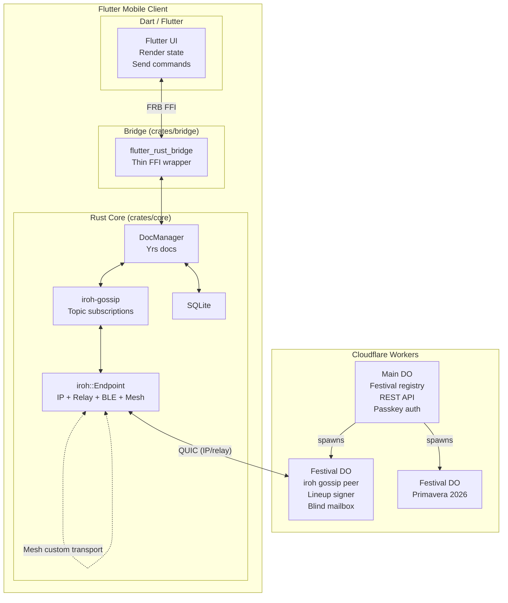
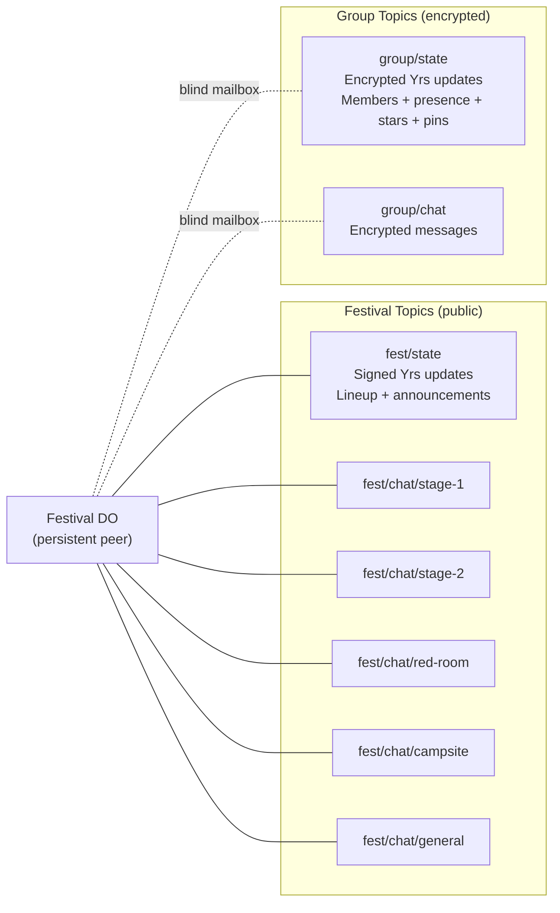

# OFFBEAT — Product Requirements Document

> Festival timeline tracker. Local-first, P2P-native, works without internet.

## Introduction

OFFBEAT is a mobile festival companion built on a peer-to-peer architecture. Users browse festival lineups, build personal schedules, form friend groups with shared presence and chat, and stay connected across any network condition — WiFi, BLE, LoRa mesh, or fully offline.

The system uses iroh as a unified transport layer (one API across all network paths), iroh-gossip for data propagation, and Yrs (Rust Yjs port) for CRDT state. The mobile app is Flutter with a Rust core via flutter_rust_bridge (FRB) v2 — a thin bridge crate delegates to a core crate containing all business logic. A lightweight Cloudflare DO acts as a persistent gossip peer and lineup publisher, but the app is fully functional without it.

## Goals & Objectives

| Goal | Metric | Target |
|------|--------|--------|
| Offline-first | Usable after cold start with no network | < 2s from local SQLite |
| Sync convergence | Check-in visible to group (WS path) | < 500ms |
| Zero-server operation | App works with no DO reachable | 100% of core features (lineup, groups, chat) |
| Minimal bandwidth | Group state update over LoRa | < 228 bytes (one meshtastic packet) |
| Lineup freshness | Signed update propagation to peers | < 30s via gossip cascade |

## Target Audience

**Primary:** Festival-goers (18-35) at multi-day electronic music festivals in Europe. Tech-comfortable, using phones for coordination, often in areas with degraded or no cell signal.

**Secondary:** Festival organizers publishing lineup data in Clashfinder format.

## User Stories

### Festival Discovery & Lineup
- **U1:** Browse upcoming festivals with metadata (name, dates, location, stages, genres).
- **U2:** Search festivals by name, city, or genre.
- **U3:** Save festivals to favourites.
- **U4:** See live festivals with pulsing indicator.
- **U5:** View lineup in a Gantt view (stages on Y, time on X, vertical scroll pans horizontally).
- **U6:** View sets grouped by day or by stage.
- **U7:** Filter sets by genre, stage, time range, starred-only.
- **U8:** Star sets to build a personal schedule.
- **U9:** See schedule clashes between starred sets.
- **U10:** See a "now playing" departures-board view during live festivals.
- **U11:** Receive lineup updates (time changes, cancellations) signed by the festival authority, relayed by any peer.

### Friend Groups
- **U12:** Create a friend group scoped to a festival.
- **U13:** Invite friends via QR code (works fully offline — BLE/mesh sync).
- **U14:** See group member list with display names.
- **U15:** See which stage each member is at (manual check-in).
- **U16:** Check in to a stage or custom location ("campsite", "at the bar") with one tap.
- **U17:** See each member's starred sets (shared schedule planning).
- **U18:** Pin shared locations ("our campsite", "meeting point").
- **U19:** Chat within the group (encrypted, private).
- **U20:** Leave a group (remove yourself from members, delete group key locally).

### Festival Chat
- **U21:** Chat within a stage-scoped channel (one per stage + campsite + general).
- **U22:** Auto-subscribe to chat for your current stage on check-in.
- **U23:** Manually subscribe to other stage chats.
- **U24:** Browse chat history for any stage (retrospective: "what did people say during Aphex Twin?").

### Connectivity
- **U25:** App works fully offline from local state.
- **U26:** See current connection mode (Full/Local/Mesh/Offline).
- **U27:** All changes sync automatically when any transport becomes available.
- **U28:** Sync with nearby friends via Bluetooth.
- **U29:** Sync group data over LoRa mesh via Meshtastic hardware.
- **U30:** Catch up on missed group activity from the DO (blind mailbox) when online.

### Auth
- **U31:** Authenticate with a passkey (biometric/PIN on device).

## System Architecture



### Gossip Topic Topology



## Data Schema

### Festival Yrs Doc (signed by festival DO)

```
Y.Map {
  "meta": Y.Map {
    name: String,
    location: String,
    edition: String,
    start_date: String,      // ISO 8601
    end_date: String,
    status: String            // upcoming | live | past
  },
  "stages": Y.Map<stage_id, {
    name: String,
    short: String,            // "S1", "RR"
    color: String,            // hex
    order: u32
  }>,
  "sets": Y.Map<set_id, {
    artist: String,
    stage_id: String,
    day: String,
    start_min: u32,           // minutes from midnight
    duration_min: u32,
    genre: String,
    cancelled: bool
  }>,
  "announcements": Y.Array<{
    id: String,
    title: String,
    body: String,
    severity: String,         // info | warning | critical
    timestamp: String
  }>
}
```

Every Yrs update is wrapped in a signed envelope:

```rust
struct SignedUpdate {
    update: Vec<u8>,          // raw Yrs update bytes
    author: NodeId,           // festival DO's iroh public key
    sig: Ed25519Signature,
}
```

Peers verify `sig` against the festival's public key before applying.

### Group Yrs Doc (encrypted with group key)

```
Y.Map {
  "members": Y.Map<user_id, {
    display_name: String,
    avatar_color: String,     // assigned on join
    joined_at: String
  }>,
  "presence": Y.Map<user_id, {
    stage_id: Option<String>,
    custom_location: Option<String>,
    status: String,           // active | idle
    updated_at: String
  }>,
  "stars": Y.Map<user_id, Y.Array<set_id>>,
  "pins": Y.Map<pin_id, {
    label: String,
    location: String,
    pinned_by: String,
    created_at: String
  }>
}
```

No signing — any group member can write. Trust is membership.

### Client SQLite (Rust — rusqlite)

```sql
CREATE TABLE docs (
    doc_id      TEXT PRIMARY KEY,
    doc_type    TEXT NOT NULL CHECK(doc_type IN ('festival', 'group')),
    yrs_state   BLOB NOT NULL,
    updated_at  TEXT NOT NULL DEFAULT (datetime('now'))
);

CREATE TABLE groups (
    group_id    TEXT PRIMARY KEY,      -- blake3(group_key)
    festival_id TEXT NOT NULL,
    name        TEXT NOT NULL,
    group_key   BLOB NOT NULL,         -- 256-bit AES key
    created_at  TEXT NOT NULL DEFAULT (datetime('now'))
);

CREATE TABLE chat_messages (
    id          TEXT PRIMARY KEY,
    topic       TEXT NOT NULL,          -- "{fest}/chat/{stage}" or "{group}/chat"
    user_id     TEXT NOT NULL,
    text        TEXT NOT NULL,
    timestamp   TEXT NOT NULL,
    encrypted   INTEGER NOT NULL DEFAULT 0
);

CREATE TABLE credentials (
    id          TEXT PRIMARY KEY,
    user_id     TEXT NOT NULL,
    passkey     BLOB NOT NULL,
    iroh_secret BLOB NOT NULL,         -- iroh ed25519 secret key
    created_at  TEXT NOT NULL DEFAULT (datetime('now'))
);

CREATE TABLE starred_sets (
    festival_id TEXT NOT NULL,
    set_id      TEXT NOT NULL,
    PRIMARY KEY (festival_id, set_id)
);

CREATE TABLE gossip_log (
    topic       TEXT NOT NULL,
    seq         INTEGER NOT NULL,
    payload     BLOB NOT NULL,         -- encrypted for group topics
    received_at TEXT NOT NULL DEFAULT (datetime('now')),
    PRIMARY KEY (topic, seq)
);
```

### Server SQLite (Main DO)

```sql
CREATE TABLE festivals (
    id          TEXT PRIMARY KEY,
    name        TEXT NOT NULL,
    year        INTEGER NOT NULL,
    location    TEXT NOT NULL,
    city        TEXT NOT NULL,
    country     TEXT NOT NULL,
    start_date  TEXT NOT NULL,
    end_date    TEXT NOT NULL,
    stages      TEXT NOT NULL,         -- JSON
    genres      TEXT NOT NULL,         -- JSON
    status      TEXT NOT NULL DEFAULT 'upcoming',
    lineup_json TEXT,                  -- raw Clashfinder JSON
    public_key  TEXT NOT NULL,         -- festival DO's iroh NodeId (hex)
    updated_at  TEXT NOT NULL DEFAULT (datetime('now'))
);

CREATE TABLE festival_history (
    festival_id TEXT NOT NULL,
    doc_type    TEXT NOT NULL,
    data        BLOB NOT NULL,
    archived_at TEXT NOT NULL DEFAULT (datetime('now')),
    PRIMARY KEY (festival_id, doc_type)
);

CREATE TABLE credentials (
    credential_id TEXT PRIMARY KEY,
    user_id       TEXT NOT NULL,
    public_key    BLOB NOT NULL,
    created_at    TEXT NOT NULL DEFAULT (datetime('now'))
);
```

## Interface Definitions

### REST API (Main DO)

| Method | Path | Response | Notes |
|--------|------|----------|-------|
| GET | `/festivals` | `Festival[]` | List with metadata + public keys |
| GET | `/festivals/:id` | `Festival` | Single festival, includes stage list |
| GET | `/festivals/:id/lineup` | Clashfinder JSON | Raw scraped data |
| POST | `/auth/register/begin` | WebAuthn options | Start passkey registration |
| POST | `/auth/register/complete` | `{ user_id }` | Complete registration |
| POST | `/auth/authenticate/begin` | WebAuthn options | Start auth |
| POST | `/auth/authenticate/complete` | `{ token }` | JWT (24h) |

### FRB API (Dart → Rust via flutter_rust_bridge)

| Command | Args | Effect |
|---------|------|--------|
| `get_festivals` | — | Returns cached festival list |
| `get_lineup` | `festival_id` | Reads festival Yrs doc → lineup |
| `star_set` | `festival_id, set_id` | Toggles in local DB + group Yrs doc |
| `check_in` | `group_id, stage_id_or_custom` | Updates group Yrs doc presence |
| `send_chat` | `topic, text` | Publishes gossip message |
| `create_group` | `festival_id, name` | Generates key, creates Yrs doc, returns QR payload |
| `join_group` | `invite_payload` | Parses QR, stores key, creates Yrs doc, writes self to members |
| `leave_group` | `group_id` | Removes self from members map, deletes group key |
| `pin_location` | `group_id, label, location` | Adds pin to group Yrs doc |
| `get_groups` | `festival_id` | Returns groups from local DB |
| `get_transport_status` | — | Returns active transports + peer counts |
| `subscribe_chat` | `topic` | Joins gossip topic for a stage |
| `unsubscribe_chat` | `topic` | Leaves gossip topic |

### Rust → Dart Streams (via FRB)

FRB maps Rust `Stream`s to Dart `Stream`s natively:

| Stream | Payload | When |
|--------|---------|------|
| `festivals_stream()` | `Vec<Festival>` | Festival list changes |
| `lineup_stream(festival_id)` | `LineupSnapshot` | Festival Yrs doc changes |
| `group_state_stream(group_id)` | `GroupState` | Group Yrs doc changes |
| `chat_stream(topic)` | `ChatMessage` | New gossip message on subscribed topic |
| `transport_stream()` | `TransportStatus` | Transport status changes |

## Functional Requirements

### FR1: Festival Registry & Lineup
- **FR1.1:** Main DO stores festival metadata and Clashfinder lineup in SQLite.
- **FR1.2:** REST API serves festival list and lineup data.
- **FR1.3:** Festival DO creates a Yrs doc from scraped lineup, signs all updates with its ed25519 key.
- **FR1.4:** Festival Yrs updates propagate via iroh-gossip on `{fest}/state` topic.
- **FR1.5:** Clients verify signature against festival's public key before applying updates.
- **FR1.6:** Peers relay signed updates to other peers (trustless relay, trusted origin).
- **Acceptance:** Seed festival data → client fetches via REST → DO publishes Yrs update → client receives via gossip → second client receives via first client relay → both show identical lineup.

### FR2: Festival DO Lifecycle
- **FR2.1:** Festival DO is lazily created on first connection within active window (start_date - 1 day to end_date + 1 day).
- **FR2.2:** Festival DO joins all gossip topics for its festival as a persistent peer.
- **FR2.3:** Festival DO stores chat history and group encrypted blobs (blind mailbox).
- **FR2.4:** On window close: archive all data to main DO history, hibernate.
- **Acceptance:** No client connects outside window → DO not created. First client connects → DO initializes. After window → DO archives and hibernates.

### FR3: iroh Transport Layer
- **FR3.1:** Single `iroh::Endpoint` with IP (built-in), relay (built-in), BLE (custom transport), and Meshtastic (custom transport).
- **FR3.2:** BLE custom transport: advertise/scan with group-derived service data, GATT sync with fragmentation for 1200-byte QUIC MTU over ~247-byte BLE MTU.
- **FR3.3:** Meshtastic custom transport: BLE GATT to meshtastic device, wrap QUIC packets in `PRIVATE_APP` protobuf, fragment for 228-byte LoRa payload.
- **FR3.4:** All transports run concurrently. iroh selects best path automatically.
- **FR3.5:** Transport status reported to webview (Full/Local/Mesh/Offline).
- **Acceptance:** Two clients sync group doc over IP. Disable IP → sync continues over BLE. Disable BLE → sync continues over mesh.

### FR4: Yrs Doc Manager
- **FR4.1:** Manages Yrs docs: one per festival (lineup), one per group (state).
- **FR4.2:** Persists all docs to SQLite as serialized Yrs state.
- **FR4.3:** Observes doc changes, emits typed IPC events to webview.
- **FR4.4:** Applies commands from webview as Yrs transactions.
- **FR4.5:** Festival doc: validates signed updates before applying.
- **FR4.6:** Group doc: encrypts outgoing updates with group key, decrypts incoming.
- **Acceptance:** `cargo test` — unit tests for doc creation, mutation, persistence, observation, signed update validation, and encryption round-trip.

### FR5: Gossip Integration
- **FR5.1:** Subscribe to festival state topic on festival open (always).
- **FR5.2:** Subscribe to stage chat topics selectively (auto on check-in, manual otherwise).
- **FR5.3:** Subscribe to group state + chat topics for all local groups.
- **FR5.4:** Yrs state updates broadcast as gossip messages (signed for festival, encrypted for group).
- **FR5.5:** Chat messages broadcast as plain gossip messages (public for festival, encrypted for group).
- **FR5.6:** Topic IDs derived deterministically: `blake3("offbeat/{festival_id}/{channel}")` for public, `blake3(group_key)` for group.
- **Acceptance:** Publish message on stage chat → received by all subscribers. Encrypted group message → received and decrypted by group members. DO stores all messages for catch-up.

### FR6: Passkey Auth
- **FR6.1:** Passkey registration on first launch.
- **FR6.2:** Passkey authenticates to main DO, receives JWT.
- **FR6.3:** iroh secret key generated on first launch, stored alongside passkey.
- **FR6.4:** User ID derived from iroh NodeId.
- **Acceptance:** Register → authenticate → receive JWT → use for REST API calls.

### FR7: Friend Groups
- **FR7.1:** Create group: generate 256-bit AES key, derive group_id via blake3, create Yrs doc, write self to members.
- **FR7.2:** QR payload: `offbeat://group/{groupId}/{base64(groupKey)}/{creatorNodeId}`.
- **FR7.3:** Join: parse QR, store key, create Yrs doc, write self to members, sync via any available transport.
- **FR7.4:** Leave: remove self from members map in Yrs doc, delete group key locally. Once peers receive the leave update, they can clean up.
- **FR7.5:** Presence: update group Yrs doc with stage or custom location on check-in.
- **FR7.6:** Stars: write starred set IDs to group Yrs doc (shared schedule).
- **FR7.7:** Pins: write shared location pins to group Yrs doc.
- **Acceptance:** Create group → QR → scan on second device → both see each other in members + presence. Check in → other device sees update. Star a set → visible in group. Leave → removed from members.

### FR8: Chat
- **FR8.1:** Stage chat: gossip messages on `{fest}/chat/{stage}` topic, auto-tagged with stage.
- **FR8.2:** Auto-subscribe to stage chat on check-in, stay subscribed when leaving.
- **FR8.3:** Group chat: encrypted gossip messages on `{group}/chat` topic.
- **FR8.4:** DO persists all chat (public as plaintext, group as encrypted blobs).
- **FR8.5:** Catch-up: on reconnect, DO replays missed messages per topic.
- **Acceptance:** Send stage chat → appears for all subscribers. Send group chat → decrypted only by group members. Reconnect after offline → catch up from DO.

### FR9: Offline & Sync
- **FR9.1:** All Yrs docs and chat messages persisted to local SQLite.
- **FR9.2:** App loads entirely from local state on cold start.
- **FR9.3:** On transport availability, gossip syncs all pending updates.
- **FR9.4:** No data loss on network partition, app kill, or transport switch.
- **Acceptance:** Airplane mode → make changes → restore connectivity → changes propagate. Kill app → relaunch → all state intact.

## Non-Functional Requirements

- **Performance:** App shell renders < 100ms from local state. Gantt scrolls at 60fps. Svelte transitions smooth (80-380ms design tokens).
- **Bundle:** Flutter app with Rust core ~15-20MB total (acceptable for native).
- **Battery:** Single iroh endpoint (not multiple connections). BLE scans at low duty cycle.
- **Security:** Group data AES-256-GCM encrypted. Lineup updates ed25519 signed. Passkey auth. QUIC TLS on all iroh connections.
- **Resilience:** 100% functional with zero network. Eventual consistency via CRDTs + gossip.
- **Compatibility:** iOS 16+, Android 13+ (Flutter + Rust cross-compilation).

## Design Considerations

Three app shell variants designed (A: Index, B: Stub Stack, C: Console). Six festival view variants (V1: Gantt, V2: Day Tabs, V3: Stage Tabs, V4: Filters, V5: Clash Radar, V6: Now Strip). Design bundles in repo.

**Recommend:** Variant A (Index) for app shell. V1-V4 for festival views. V5-V6 as stretch.

**Design tokens** (from OFFBEAT design system):
- Dark brutalist: `--bg: #0B0B0C`, `--accent: #FF2D8F` (magenta)
- Fonts: Helvetica (sans), JetBrains Mono (mono)
- Borders: 1.5px dotted, zero border-radius everywhere
- Motion: 80-380ms, `cubic-bezier(0.2, 0.7, 0.2, 1)`

## Atomic Task List

### Phase 1: Scaffold
- [ ] pnpm workspace + turbo.json + biome
- [ ] Cargo workspace with `crates/core` (all logic) + `crates/bridge` (thin FRB wrapper)
- [ ] `apps/mobile` — Flutter project with flutter_rust_bridge
- [ ] `apps/server` — Cloudflare Workers + Hono
- [ ] `packages/protocol` — shared TS types
- [ ] Wire `pnpm check` → turbo runs biome + tsc + cargo clippy + cargo test

### Phase 2: Protocol & Data Model
- [ ] TS types: Festival, Stage, Set, Day, Lineup, ChatMessage, TransportStatus
- [ ] Clashfinder parser + test with Field Day fixture
- [ ] Rust types (serde) mirroring TS types
- [ ] IPC command + event types (Rust + TS)
- [ ] SQLite schemas (client + server)
- [ ] Rust DB module (rusqlite, migrations, CRUD methods)

### Phase 3: Server
- [ ] Main DO: festival CRUD, SQLite, REST API
- [ ] Main DO: passkey registration/authentication endpoints
- [ ] Festival DO: lazy creation within active window
- [ ] Festival DO: iroh gossip peer (lineup state topic + chat topics)
- [ ] Festival DO: blind mailbox for encrypted group gossip
- [ ] Festival DO: signed Yrs lineup updates
- [ ] Festival DO: archival to main DO on window close

### Phase 4: Rust Core — iroh + Yrs + Gossip
- [ ] iroh::Endpoint setup with IP + relay
- [ ] DocManager: Yrs doc lifecycle (create, load, persist, observe)
- [ ] DocManager: signed update verification for festival docs
- [ ] DocManager: AES-256-GCM encryption for group docs
- [ ] Gossip manager: topic subscription, message dispatch
- [ ] Gossip → DocManager bridge: Yrs updates from gossip applied to docs
- [ ] Gossip → chat bridge: plain messages stored in SQLite
- [ ] IPC bridge: Tauri commands + events wired to DocManager + Gossip
- [ ] Topic ID derivation: blake3 for public topics, blake3(group_key) for group topics

### Phase 5: Flutter Bridge + UI
- [ ] `crates/bridge/src/api.rs`: FRB-annotated functions wrapping core OffbeatNode
- [ ] Flutter design system (theme, colors, typography matching OFFBEAT tokens)
- [ ] App shell (Variant A): top nav, tab bar, page transitions
- [ ] Festival list: search, saved/discover, festival rows
- [ ] Festival detail: day pills, view switcher
- [ ] Gantt view (V1): scroll-to-pan, stage rows, set blocks, now line
- [ ] Day tabs (V2): ticket-stub day picker, hour-grouped list
- [ ] Stage tabs (V3): horizontal tabs, stage hero, lineup
- [ ] Filter panel (V4): bottom sheet, stage grid, time range, genre chips, toggles
- [ ] Connection status indicator
- [ ] Wire all views to Rust core via FRB streams

### Phase 6: Auth + Groups
- [ ] Passkey flow (WebAuthn via webview bridge)
- [ ] iroh identity generation + storage
- [ ] Group creation: key gen, Yrs doc, QR payload
- [ ] QR display + camera scanner
- [ ] Group join: parse QR, store key, write to members, sync
- [ ] Group leave: remove from members, delete key
- [ ] Group presence UI: member list, stage indicators, check-in button
- [ ] Group stars: shared schedule view
- [ ] Group pins: shared location markers

### Phase 7: Chat
- [ ] Stage chat: gossip publish/subscribe per stage topic
- [ ] Auto-subscribe on check-in
- [ ] Chat UI: message list, input, stage filter
- [ ] Group chat: encrypted gossip on group chat topic
- [ ] DO catch-up: replay missed messages on reconnect
- [ ] Chat history browsing (retrospective stage view)

### Phase 8: P2P Transports
- [ ] BLE custom transport: discovery, GATT service, fragmentation layer
- [ ] Meshtastic custom transport: BLE GATT to device, protobuf wrapping, fragmentation
- [ ] Transport status UI: multi-transport indicator with detail view
- [ ] Integration test: sync across transport fallback chain

## Success Metrics

| Metric | Target | Measurement |
|--------|--------|-------------|
| Offline usability | 100% core features | Manual: airplane mode walkthrough |
| Sync correctness | Zero data loss | Automated: create conflicts, verify convergence |
| Group join (QR → synced) | < 3s on WiFi | Instrumented |
| Gantt scroll perf | 60fps | DevTools profiling |
| BLE sync (check-in) | < 5s | Two-device test |
| Mesh sync (check-in) | < 30s | Two-device test with meshtastic |
| Signed lineup relay | Peers verify + apply | Automated: tampered update rejected |

## Open Questions & Future Considerations

- **App shell variant:** Recommend A, confirm with user.
- **Clash radar + now-strip (V5/V6):** Defer to V2?
- **Friend graph across festivals:** Auto-create groups for returning friend clusters.
- **Push notifications:** Notify when starred set starts. Native push integration.
- **Organizer portal:** Web UI for lineup upload/editing.
- **Meshtastic chat fragmentation:** Messages > 228 bytes need fragmentation. Defer until chat-over-mesh needed.
- **Lineup scraping automation:** Workers cron to re-scrape periodically.
- **Group key rotation:** For revoking access. V2 feature.
- **iroh relay self-hosting:** Self-host on Fly/CF for lower latency vs n0 public relays.
